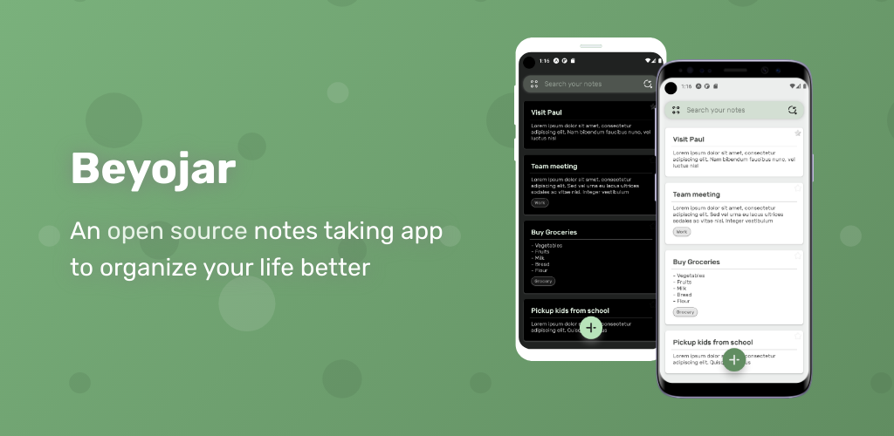

<br>
<h1 align="center"> <b>Beyojar</b> </h1> 
<h4 align="center">A minimal, open source notes app built with <a href="https://reactnative.dev" target="_blank">React-Native</a> & <a href="https://docs.expo.dev" target="_blank">Expo</a>.</h4>
<br>

<p align="center">
  <a href="https://reactnative.dev">
    
  </a>
  <a href="https://www.typescriptlang.org">
    
  </a>
  <a href="https://docs.expo.dev">
    
  </a>
</p>

<p align="center">
  <a href="https://sonarcloud.io/component_measures?metric=Maintainability&id=kaje94_beyojar">
    
  </a>
  <a href="https://sonarcloud.io/component_measures?metric=Coverage&view=list&id=kaje94_beyojar">
    
  </a>
  <a href="https://sonarcloud.io/component_measures?metric=bugs&id=kaje94_beyojar">
    
  </a>
  <a href="https://sonarcloud.io/component_measures?metric=vulnerabilities&id=kaje94_beyojar">
    
  </a>
  <a href="https://sonarcloud.io/component_measures?metric=code_smells&id=kaje94_beyojar">
    
  </a>
  <a href="https://sonarcloud.io/component_measures?metric=Reliability&id=kaje94_beyojar">
    
  </a>
</p>

<p align="center">
  <a href="https://gitter.im/beyojar/community?utm_source=badge&utm_medium=badge&utm_campaign=pr-badge">
    
  </a>
  <a href="https://saythanks.io/to/a.kajendran">
    
  </a>
</p>

<p align="center">
  <a href="#introduction">Introduction</a> •
  <a href="#prerequisite">Prerequisite</a> •
  <a href="#how-to-use">How To Use</a> •
  <a href="#contributing">Contributing</a> •
  <a href="#license">License</a>
</p>
<p align="center">
  <a href="https://beyojar.com">
    
  </a>
</p>
<br>
  <p align="center">
  <a href="https://apps.apple.com/us/app/beyojar/id6443962955">
    
  </a> 
  <a href="https://play.google.com/store/apps/details?id=com.beyojar">
    
  </a>
  </p>
<br>

## Introduction

-   Beyojar is a simple notes taking application built for Android & IOS using [React-Native](https://reactnative.dev/) & [Expo](https://docs.expo.dev)
-   The [mobile](mobile) workspace contains all the code related to the mobile application
-   -   This app provides a simple and familiar interface that allows users to to get started immediately
-   -   Allows users to keep their notes organized with labels and colors
-   -   Mark important notes so that users will never miss it
-   -   Supports both Dark and Light themes, based on user preference
-   The [landing](landing) workspace contains all the code related to the landing page that is built using [Qwik](https://qwik.builder.io/)
-   -   SEO optimized, pre-rendered landing page that allows users to easily understand what _Beyojar_ provides

## Prerequisite

-   [Git](https://git-scm.com)
-   [Node.js 16+](https://nodejs.org/en/download/)
-   [NPM 7+](http://npmjs.com)
-   [Android Studio](https://developer.android.com/studio) (Needed only if you want to run the app in an Android emulator)
-   [Xcode](https://developer.apple.com/xcode/) (Needed only if you want to run the app in an iOS emulator)

## How To Use

From your command line:

```bash
# Clone this repository
$ git clone https://github.com/kaje94/beyojar

# Go into the repository
$ cd beyojar

# Install dependencies
$ npm install
```

Scripts related to running the mobile app:

```bash
# Start the expo development server to work on your project by running:
$ npm run start:expo

# Start the expo development server and launch the Android app by running:
$ npm run start:android
# Either an android emulator or an android device with usb-debugging turned on, must be available

# Start the expo development server and launch the IOS app by running:
$ npm run start:ios
# Xcode must to available in order to run this command

# Start the expo development server and launch the expo app in a browser by running:
$ npm run start:web
```

Scripts related to building & running the landing page:

```bash
# Start the landing page in dev mode by running:
$ npm run start:landing

# Build the landing page in production mode by running:
$ npm run build:landing

# Deploy the landing page build files in localhost by running:
$ npx http-server landing/dist
# Can also use alternatives such as Browsersync, lite-server, serve or static-server
```

Scripts related to linting and formatting:

```bash
# Check if there are any linting issues in both mobile and landing workspace by running:
$ npm run lint

# Check & fix fixable linting issues in both mobile and landing workspace by running:
$ npm run lint:fix

# Format other files types such as .json, .md & .css by running:
$ npm run format-rest

# These scripts will also automatically run via the pre-commit hook when you perform a commit
```

Scripts related to storybook in the mobile workspace:

```bash
# Open storybook in development mode by running:
$ npm run storybook:mobile

# Run storybook tests by running:
$ npm run storybook-test:mobile
# Make sure to have storybook running in dev mode or production mode before running this command

# Build storybook in production mode by running:
$ npm run storybook-build:mobile
```

## Contributing

Please refer the [Contributing.md](.github/CONTRIBUTING.md) in order to contribute towards this project

## License

[](LICENSE)

> [a.kajendran@gmail.com](mailto:a.kajendran@gmail.com) &nbsp;&middot;&nbsp;
> GitHub [@kaje94](https://github.com/kaje94) &nbsp;&middot;&nbsp;
